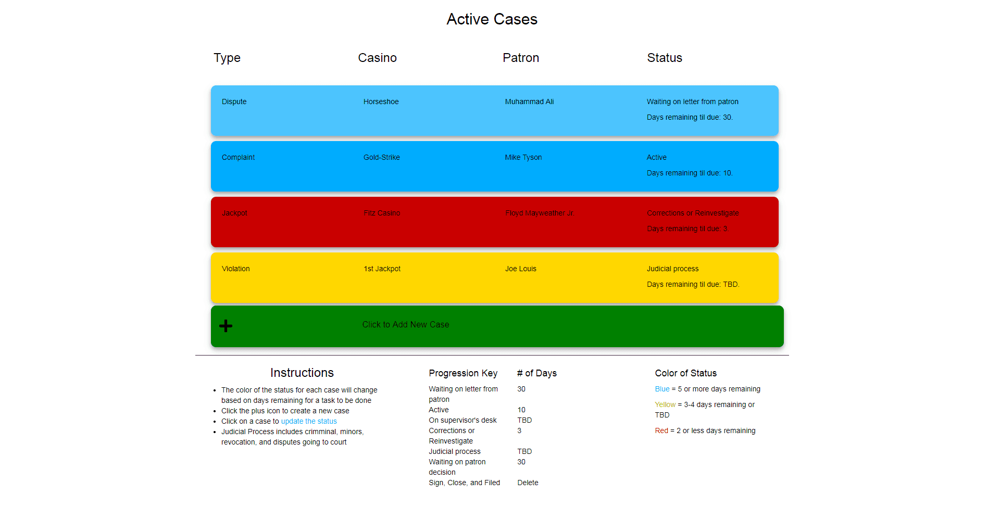

# Active Cases

 

### Table of Contents
1. Project Demo Link
2. Purpose
3. Motivation
4. Objectives
5. How to Use
6. Technologies Used

### Deployed Production Link: [Active Cases](https://active-cases.herokuapp.com/)

### Purpose:
A case management app designed to keep the user informed of the current status of each case and allow management of the user's portfolio of cases. It's deployed as a progressive web app designed for the desktop.

### Motivation:
As a senior law enforcement/regulatory agent I have seen work cases lost, forgotten, and mismanaged due to inexperience or an overloaded case load. This will implement a formal process to organize cases and provide a quick summary of workload for management. The app will introduce a system of controls to assign status to cases and prioritize time sensitive cases. 
### Objectives:
* Installable on desktop work computer or personal mobile devices via the internet
* Ability to create a new case in 2 minutes
* Separate status for legal and regulatory cases
* Provide information about the case via color-coding (quick peek) or text (in-depth study)

### How to Use:
1. Click the large green button title "Click to Add New Case"
2. Use the drop down menus to create a new case based on type of investigation, casino, patron name/case number, and current status of the case. Then click the green submit button.
3. Based on your selection a new case will be added
4. The case will be color-coded based on a priority criteria and days remaining till it needs to be submitted to managment.
5. To update a case simply click on the case and use the drop down menu to change the status.
6. The case will change colors based on the days remaining to be submitted to management. 

### This app was built with the following technologies:
**React:** JavaScript front-end library for building user interfaces.

**Heroku:** A cloud platform (PaaS) for deploying web apps

**Node.js** Server side development platform created to run JavaScript

**ExpressJS** A Node.js web application server framework
 
**Git-Hub:** web-based version control repository and Internet hosting service
 
**Bootstrap:** Web development framework for developing responsive, mobile first front-end projects
  
**JavaScript:** object-oriented programming language for web pages
 
**HTML5:** Mark-up language for creating web pages and local storage of data in the browser
 
**CSS:** A formatting language for styling web pages
 
*Create by JC Smiley in July of 2018*